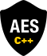

# AES C++ Library

[](https://forthebadge.com)

aes-lib-cpp is a complete [AES/Rijndael](https://en.wikipedia.org/wiki/Advanced_Encryption_Standard) C++ implementation  
The library supports the industry standard of 128 bit key sizes and runs in CBC mode  
Included also is the supporting [research work](AESAppliedInWebTechnology.pdf) that was written for this project  
For the Javascript version of this library see [aes-lib-js](https://github.com/kyleruss/aes-lib-cpp)

## Usage
### Encrypting
You can use the following function to encrypt a plain-text message  
You will need to input your plain-text bytes, the private-key, an IV and the key size (SMALL=128, MEDIUM=192, LARGE=256)  
See notes below about the data type aliases used in aes-lib-cpp  
The plain-text bytes in `text` are overwritten with the encrypted bytes
```
void AES::encryptMessage(std::vector<State*> &text, Key &privateKey, State &initialVector, KeyLength length)
```

### Decrypting
Similarly, you can use the following funciton to decrypt an encrypted message  
The cipher-text bytes in `text` are overwritten with decrypted plain-text bytes

```
void AES::decryptMessage(std::vector<State*> &text, Key &privateKey, State &initialVector, KeyLength length)
```

### Data type aliases
There are several noteable data type aliases used in aes-lib-cpp
- BYTE: `std::bitset<8>`
- State: `BYTE[4][4]`
- Key: `BYTE[4][4]`

## Getting started
### Prerequisites
- Visual Studio 2013

### Installation
- Clone the aes-lib-cpp
```
git clone https://github.com/kyleruss/aes-lib-cpp.git
```

- Open the VS solution `AESImplementation.sln`
- Build the solution in Visual Studio

## License
aes-lib-cpp is available under the MIT License  
See [LICENSE](LICENSE) for more details
